# Analisis 10 Kompetitor & Blueprint Master Plan "Market Winner" — IDMark

> Dokumen Strategis Produk & Arsitektur Rekayasa Perangkat Lunak
> Disusun oleh: Autonomous Lead Software Architect & Principal Product Engineer
> Tanggal: 28 September 2026
> Aplikasi: **IDMark** (`idmark.faishal.id` / `id.faishal.idmark`)

---

## Executive Summary

Dalam era digitalisasi verifikasi identitas (Know Your Customer / KYC), foto dokumen sensitif seperti Kartu Tanda Penduduk Elektronik (e-KTP), Surat Izin Mengemudi (SIM), Paspor, dan kartu identitas global (Aadhaar, MyKad) seringkali disalahgunakan untuk pinjaman online ilegal, penipuan finansial, dan pencurian identitas.

Regulator seperti Kementerian Komunikasi dan Informatika (Kominfo) Indonesia dan standar UU No. 27 Tahun 2022 tentang Pelindungan Data Pribadi (UU PDP) secara tegas merekomendasikan:
1. Menambahkan watermark teks yang memuat **tujuan spesifik** dan **tanggal transaksi**.
2. Menyensor (**redaction**) bagian sensitif yang tidak dibutuhkan pihak ketiga (misalnya: tanda tangan atau sebagian digit nomor identitas).
3. Menghapus **metadata EXIF** (lokasi GPS, tipe kamera/perangkat, timestamp asli) dari file gambar sebelum dibagikan.

Dokumen ini membedah 10 kompetitor terkemuka di pasar (lokal dan global), melakukan analisis kesenjangan (*gap analysis*) terhadap IDMark saat ini, dan menetapkan blueprint implementasi bertahap untuk menjadikan IDMark sebagai **Market Winner** di kelasnya: **100% on-device, privasi mutlak (zero server upload), fitur terlengkap (watermark multi-pola, sensor redaksi, sanitasi EXIF, audit log lokal, preset kustom, skor kepatuhan PDP).**

---

## Bagian 1: Benchmarking & Bedah 10 Kompetitor

### 1. Daftar 10 Kompetitor (Direct & Indirect)

| No | Nama Kompetitor | Tipe & Platform | URL / Sumber | Fokus Utama |
|---|---|---|---|---|
| 1 | **WatermarkKTP** (Sirilius Kevin) | Web (Client-side HTML5/Canvas) | `watermarkktp.com` / GitHub | Direct: Watermark e-KTP khusus Indonesia |
| 2 | **Watermarkly** | Web & Desktop (Freemium) | `watermarkly.com` | Direct: Bulk photo & document watermarking |
| 3 | **Visual Watermark** | Web & Desktop (Windows/Mac) | `visualwatermark.com` | Direct: Anti-theft watermark, multi-layer text |
| 4 | **iLovePDF Watermark** | Web & API (SaaS Cloud) | `ilovepdf.com/watermark-pdf` | Indirect: PDF stamping & 9-position selector |
| 5 | **PDF24 Tools (Watermark & Redact)** | Web & Desktop (Free) | `tools.pdf24.org` | Indirect: Redaction blackout & text stamp |
| 6 | **Redactable** | Web SaaS (Enterprise) | `redactable.com` | Indirect: PII redaction, permanent pixel mask, EXIF scrubber |
| 7 | **Salt Watermark** | Android App (Mobile) | Google Play Store | Direct: Batch photo watermark, GPS & timestamp stamp |
| 8 | **Add Watermark on Photos** (Simply Entertaining) | Android & iOS (Mobile App) | Google Play / App Store | Direct: QR code stamp, seal badge, tile grid pattern |
| 9 | **Adobe Acrobat Online (Redact & Watermark)** | Web & Enterprise (Adobe Cloud) | `acrobat.adobe.com` | Indirect: Enterprise standard black-bar redaction & audit trail |
| 10 | **Aadhaar Masker / KYC Shield** (CamScanner ID Mode) | Mobile & Web Utilities | `myaadhaar.uidai.gov.in` / Market | Direct: Partial number masking & KYC purpose seal |

---

### 2. Bedah Mendalam Setiap Kompetitor

#### Kompetitor 1: WatermarkKTP (Sirilius Kevin)
- **Fitur Unggulan**:
  - Open-source, berjalan 100% di browser pengguna tanpa pengunggahan server.
  - Sederhana: input teks, pilihan font bawaan, rotasi slider, opasitas slider, dan unduh gambar.
- **Arsitektur Layar**:
  - Layar tunggal (Single Page Application / SPA) monolitik. Form input di sisi kiri/bawah dan kanvas HTML5 di sisi kanan/atas.
  - Tidak ada tab navigasi, tidak ada halaman preset tersimpan, tidak ada riwayat, tidak ada panduan interaktif.
- **Aliran Data**:
  - *Displayed Data*: Kanvas pratinjau gambar, input form teks tujuan, slider ukuran font, slider rotasi, slider opasitas.
  - *Stored Data*: Tidak ada penyimpanan lokal (setiap reload halaman harus mengulang dari nol).
  - *Processed Data*: Operasi 2D Canvas HTML5 render teks tunggal diagonal.
- **Kelebihan vs Kelemahan**:
  - *Kelebihan*: Cepat, open source, terpercaya karena kode publik.
  - *Kelemahan*: Pilihan pola terbatas (hanya 1 teks tunggal), tidak ada sensor/redaksi bagian sensitif (tanda tangan/NIK), tidak bisa simpan preset sendiri, UI sangat minimalis tanpa tema responsif modern.

#### Kompetitor 2: Watermarkly
- **Fitur Unggulan**:
  - Watermark batch (banyak foto sekaligus), dukungan logo + teks bertingkat.
  - Penyesuaian otomatis ukuran watermark berdasarkan rasio resolusi foto.
- **Arsitektur Layar**:
  - Layar Upload (Drag & drop zone) -> Layar Editor Multi-Layer (Tools top bar, preview canvas, right inspector panel) -> Dialog Export (Format JPG/PNG/WEBP, quality slider, resize options).
- **Aliran Data**:
  - *Displayed Data*: Thumbnail grid foto terunggah, editor layer teks/logo, parameter opacity, color picker, position presets.
  - *Stored Data*: LocalStorage browser menyimpan template terakhir.
  - *Processed Data*: Skalasi komputasi resolusi gambar, pembersihan metadata EXIF dasar.
- **Kelebihan vs Kelemahan**:
  - *Kelebihan*: Pengalaman desktop kaya fitur, opsi ekspor bervariasi.
  - *Kelemahan*: Pada versi web gratis memberi watermark logo Watermarkly (branding terpaksa), tidak memiliki preset kepatuhan regulasi identitas (e-KTP/KYC), beberapa alur memicu pemrosesan server.

#### Kompetitor 3: Visual Watermark
- **Fitur Unggulan**:
  - Perlindungan anti-penghapusan watermark berbasis AI (pola tekstur berlapis, font outline & fill).
  - Template watermark kombinasi (Nama + Tanggal + Nomor Registrasi + Logo).
- **Arsitektur Layar**:
  - Welcome Screen -> File Selection -> Grouping Screen -> Template Gallery -> Fine-Tuning Editor -> Export Progress & Summary.
- **Aliran Data**:
  - *Displayed Data*: Galeri font (60+ font), slider padding, slider tile spacing, preview mode gelap/terang.
  - *Stored Data*: File konfigurasi template `.vwm`.
  - *Processed Data*: Algoritma rendering multi-pass canvas dengan noise filter.
- **Kelebihan vs Kelemahan**:
  - *Kelebihan*: Visual typography sangat solid dan sulit dihapus alat AI watermark remover.
  - *Kelemahan*: Berbayar (license paywall), ukuran aplikasi berat, tidak ada fitur redaksi NIK/tanda tangan ID card.

#### Kompetitor 4: iLovePDF Watermark
- **Fitur Unggulan**:
  - Grid 9 posisi (Top-Left, Center, Bottom-Right, dll.), teks atau gambar stempel, seleksi halaman.
- **Arsitektur Layar**:
  - File Dropzone -> Stamping Config Modal (Position 3x3 selector, Text input, Opacity, Font format) -> Download Page.
- **Aliran Data**:
  - *Displayed Data*: Visual matrix 3x3 posisi, preview thumbnail PDF.
  - *Stored Data*: Sesi sementara di cloud server.
  - *Processed Data*: PDF stream manipulation (menambahkan teks watermark ke layer PDF).
- **Kelebihan vs Kelemahan**:
  - *Kelebihan*: Standar industri posisi 3x3 yang sangat intuitif.
  - *Kelemahan*: Membutuhkan upload dokumen ke cloud server (berisiko melanggar prinsip zero-server upload e-KTP), fitur khusus dokumen PDF bukan image canvas ID card.

#### Kompetitor 5: PDF24 Tools (Watermark & Redact)
- **Fitur Unggulan**:
  - Alat redaksi privasi gratis: menggambar kotak hitam (*blackout rectangle*) di atas data sensitif dan menstempel teks watermark.
- **Arsitektur Layar**:
  - Tool Index Page -> Specific Tool (Redact Tool / Watermark Tool) -> Canvas Editor dengan Toolbar (Pencil, Blackout Box, Text Stamp) -> Download Action.
- **Aliran Data**:
  - *Displayed Data*: Daftar kotak redaksi, koordinat X/Y box, text styling.
  - *Stored Data*: Riwayat tugas di browser session.
  - *Processed Data*: Rasterisasi permanen (meratakan layer kotak hitam agar tidak bisa di-undone oleh pihak lain).
- **Kelebihan vs Kelemahan**:
  - *Kelebihan*: Memiliki konsep redaksi (blackout) untuk menutup data sensitif.
  - *Kelemahan*: UI kaku seperti desktop lama, tidak mobile-friendly, alat redaksi dan watermark terpisah di dua halaman berbeda (tidak terintegrasi dalam 1 flow identitas).

#### Kompetitor 6: Redactable
- **Fitur Unggulan**:
  - Penghapusan PII permanen: membersihkan metadata tersembunyi (EXIF, XMP, GPS, serial kamera) dan menghancurkan piksel di bawah area sensor (bukan sekadar menempel kotak di atasnya).
  - Audit trail dan sertifikat kepatuhan privasi (HIPAA, GDPR).
- **Arsitektur Layar**:
  - Dashboard Dokumen -> Redaction Workspace (Auto-detect PII, Manual Box Selector, Stamp Watermark) -> Sanitization Review -> Download & Audit Certificate.
- **Aliran Data**:
  - *Displayed Data*: Kotak pembatas merah/hitam, daftar metadata yang terdeteksi, ringkasan data yang dihapus.
  - *Stored Data*: Database cloud enterprise, audit log redaction.
  - *Processed Data*: Metadata parser & stripper, pixel byte scrubbing.
- **Kelebihan vs Kelemahan**:
  - *Kelebihan*: Keamanan data tingkat tinggi dengan penghapusan metadata dan audit trail.
  - *Kelemahan*: Mahal (berlangganan B2B), harus upload file ke cloud, terlalu rumit untuk pengguna umum yang hanya ingin membagikan e-KTP ke leasing/bank.

#### Kompetitor 7: Salt Watermark (Android)
- **Fitur Unggulan**:
  - Otomatisasi stempel tanggal & waktu saat ini, penomoran urut, penyimpanan template kustom.
- **Arsitektur Layar**:
  - Gallery Picker Screen -> Template Picker Bottom Sheet -> Interactive Move/Scale Gesture Canvas -> Save to Gallery Dialog.
- **Aliran Data**:
  - *Displayed Data*: Dynamic date token (`{date}`, `{time}`), gesture bounding box.
  - *Stored Data*: SQLite / SharedPreferences daftar template pengguna.
  - *Processed Data*: Android Bitmap matrix transformation.
- **Kelebihan vs Kelemahan**:
  - *Kelebihan*: Pengoperasian mobile sangat cepat dengan token tanggal dinamis.
  - *Kelemahan*: Penuh iklan banner/interstitial yang mengganggu, tidak memiliki panduan keamanan ID e-KTP, tidak ada fitur sensor.

#### Kompetitor 8: Add Watermark on Photos (Simply Entertaining)
- **Fitur Unggulan**:
  - QR Code watermark generator (menghasilkan stempel QR verifikasi langsung di gambar), stempel lencana melingkar (*seal badge*), pola ubin berulang (*repetitive cross tiles*).
- **Arsitektur Layar**:
  - Home Screen -> Editor Workspace -> Tab Menu (Text, QR Code, Logo, Seal) -> Style Drawer (Color, Shadow, Opacity) -> Export Screen.
- **Aliran Data**:
  - *Displayed Data*: QR payload preview, lencana segel dengan teks melingkar, tile density slider.
  - *Stored Data*: Database preset pengguna, histori ekspor foto.
  - *Processed Data*: QR generator, canvas circular path text rendering.
- **Kelebihan vs Kelemahan**:
  - *Kelebihan*: Sangat variatif dengan stempel QR dan lencana resmi.
  - *Kelemahan*: Antarmuka penuh opsi membingungkan pengguna awam, butuh banyak tap untuk membuat watermark e-KTP sederhana.

#### Kompetitor 9: Adobe Acrobat Online (Redact & Watermark)
- **Fitur Unggulan**:
  - Standar enterprise untuk sensor dokumen resmi (Blackout atau Mosaic blur) + Watermark Header/Footer resmi dengan enkripsi.
- **Arsitektur Layar**:
  - Acrobat Web Shell -> Document Viewer -> Redaction Toolbar -> Mark for Redaction -> Apply Redactions Dialog -> Add Watermark Drawer -> Export.
- **Aliran Data**:
  - *Displayed Data*: Redaction preview boxes, overlay text preview, zoom controls.
  - *Stored Data*: Adobe Document Cloud profile.
  - *Processed Data*: Flattening engine yang menggantikan piksel asli dengan piksel hitam/buram murni.
- **Kelebihan vs Kelemahan**:
  - *Kelebihan*: Mutu keamanan terjamin, visual profesional.
  - *Kelemahan*: Wajib login Adobe ID, berbayar untuk penggunaan rutin, dokumen tersimpan di cloud Adobe.

#### Kompetitor 10: Aadhaar Masker & KYC Shield (CamScanner ID Mode)
- **Fitur Unggulan**:
  - Masking mode cerdas untuk dokumen identitas (menutup 8 digit pertama nomor identitas, hanya menampilkan 4 digit terakhir), stempel "FOR KYC VERIFICATION ONLY".
- **Arsitektur Layar**:
  - Camera ID Scanner Frame (dengan panduan e-KTP/Aadhaar) -> Crop & Perspective Correction -> ID Mode Options (Mask ID Number, Add Purpose Stamp) -> Export Card View.
- **Aliran Data**:
  - *Displayed Data*: Outline kotak KTP, kartu panduan letak NIK/tanda tangan, pilihan preset instansi (Bank, SIM, Paspor).
  - *Stored Data*: Cache lokal perangkat.
  - *Processed Data*: Rectangular overlay masking, text overlay rendering.
- **Kelebihan vs Kelemahan**:
  - *Kelebihan*: Sangat relevan dengan alur birokrasi identitas KYC dunia nyata.
  - *Kelemahan*: Sebagian besar aplikasi scanner pihak ketiga mengumpulkan analitik atau mewajibkan akun premium.

---

### 3. Matriks Perbandingan 10 Kompetitor vs IDMark Saat Ini

| Parameter / Fitur | WatermarkKTP | Watermarkly | Visual Watermark | iLovePDF | PDF24 | Redactable | Salt Watermark | Add Watermark | Adobe Acrobat | Aadhaar Masker | **IDMark Saat Ini** | **IDMark Target (Winner)** |
|---|---|---|---|---|---|---|---|---|---|---|---|---|
| **Zero Server Upload (100% On-Device)** | Ya | Parsial | Ya | Tidak | Parsial | Tidak | Ya | Ya | Tidak | Parsial | **Ya** | **Ya (100% Client-Side)** |
| **Pola Watermark Khusus Dokumen ID** | 1 (Diagonal) | Umum | Umum | 9 Posisi | Umum | Teks Biasa | Umum | Variatif | Header/Footer | Segel KYC | **4 Pola** | **7 Pola Lengkap** (Diagonal, Grid, Bottom, Corner, Seal, X-Cross, QR Badge) |
| **Fitur Redaksi / Sensor Sensitif (NIK, TTD)** | Tidak | Tidak | Tidak | Tidak | Ya | Ya | Tidak | Tidak | Ya | Ya | **Tidak Ada** | **Ya** (Blackout, Mosaic/Pixelate, Blur) |
| **Sanitasi Metadata EXIF Dokumen** | Tidak | Dasar | Dasar | Tidak | Tidak | Ya | Tidak | Tidak | Ya | Tidak | **Tidak Ada** | **Ya** (Auto-strip EXIF/GPS, SHA-256 Checksum) |
| **Katalog Preset Resmi Regulasi** | Tidak | Tidak | Tidak | Tidak | Tidak | Tidak | Tidak | Tidak | Tidak | Ya | **8 Preset Dasar** | **20+ Preset Terkategori + Custom Creator** |
| **Kustom Preset Pengguna (CRUD Simpan Sendiri)**| Tidak | Ya | Ya | Tidak | Tidak | Tidak | Ya | Ya | Tidak | Tidak | **Tidak Ada** | **Ya** (Simpan & kelola preset lokal pengguna) |
| **Riwayat Ekspor & Audit Log On-Device** | Tidak | Tidak | Tidak | Tidak | Tidak | Ya | Ya | Ya | Ya | Tidak | **Tidak Ada** | **Ya** (Audit log lokal, hash integritas) |
| **Opsi Format Ekspor** | PNG | Multi | Multi | PDF | Multi | PDF | JPG/PNG | Multi | PDF | JPG/PDF | **Hanya PNG** | **PNG, JPEG, & PDF Document** |
| **Skor Proteksi Privasi (Privacy Meter)** | Tidak | Tidak | Tidak | Tidak | Tidak | Ya | Tidak | Tidak | Tidak | Tidak | **Tidak Ada** | **Ya** (Analisis kepatuhan dokumen A+ s.d. F) |
| **Bebas Akun, Bebas Iklan, Gratis Selamanya** | Ya | Tidak | Tidak | Tidak | Ya | Tidak | Tidak | Tidak | Tidak | Tidak | **Ya** | **Ya** |

---

## Bagian 2: Gap Analysis & Blueprint "Market Winner"

### Gap Analysis Codebase Saat Ini
1. **Fitur Sensor / Redaksi Belum Ada**: Saat ini pengguna hanya bisa menempelkan teks watermark, padahal banyak lembaga peminjam/fintech hanya butuh NIK dan nama, sedangkan tanggal lahir, tanda tangan, atau alamat boleh atau wajib disamarkan.
2. **Ketiadaan Pilihan Format Ekspor**: Saat ini hanya merender PNG statis. Tidak ada opsi JPEG dengan optimasi ukuran, atau PDF siap cetak.
3. **Preset Masih Statis & Terbatas**: Preset hanya 8 buah tanpa fitur pencarian, filter kategori, dan pengguna tidak bisa membuat atau menyimpan preset kustom sendiri.
4. **Pola Watermark Masih Terbatas**: Baru ada 4 pola. Belum ada pola Segel Resmi (*Security Seal*), Pola Silang (*X-Cross Band*), dan *QR Security Badge*.
5. **Belum Ada Audit Trail & Riwayat Ekspor Lokal**: Pengguna tidak dapat melihat kembali daftar dokumen apa saja yang telah mereka beri watermark beserta tanggal dan tujuan penggunaannya.
6. **Belum Ada Evaluator Kepatuhan Privasi (Privacy Protection Scorecard)**: Pengguna tidak mengetahui apakah dokumen mereka sudah memenuhi kaidah aman UU PDP / Kominfo.
7. **Pembersihan Metadata EXIF**: Dokumen kamera e-KTP sering mengandung koordinat GPS rumah pemilik dokumen. Belum ada visualisasi dan jaminan pembersihan metadata ini.

---

### Strategi "Market Winner": Mengapa IDMark Menjadi Terbaik di Kelasnya

1. **All-in-One Privacy Engine for ID Documents**: Menggabungkan kapabilitas penandaan watermark, sensor redaksi data sensitif, pembersihan EXIF, dan generasi checksum integritas dalam satu kanvas intuitif.
2. **Zero-Trust On-Device Architecture**: Semua kalkulasi piksel gambar terjadi di memori peramban/perangkat menggunakan Flutter Canvas dan Flutter Image API. Tidak ada server eksternal, tidak ada analitik pelacak.
3. **Ekosistem Navigasi Terstruktur**:
   - `/`: **Studio Editor** (Tab Watermark, Tab Redaksi/Sensor, Tab Privasi & Metadata, Tab Ekspor).
   - `/presets`: **Template & Preset Hub** (Katalog 20+ preset terverifikasi, pencarian instan, filter kategori, pembuat preset kustom).
   - `/history`: **Audit Log & Riwayat Lokal** (Daftar dokumen yang telah distempel, status keamanan, ekspor ulang).
   - `/guide`: **Pusat Panduan & Edukasi Keamanan** (Panduan resmi Kominfo, UU PDP, checklist keamanan sebelum kirim foto KTP).
   - `/settings`: **Pengaturan Privasi & Sanitasi Data** (Kontrol preferensi bawaan, pembersih cache, zero-telemetry badge).

---

## Bagian 3: Target Site Map & Screen Architecture

```mermaid
flowchart TD
    Root["Root Navigation Shell (Bottom Nav / Sidebar)"]
    
    Branch1["1. Studio Editor ('/')"]
    Branch2["2. Template & Preset Hub ('/presets')"]
    Branch3["3. Audit Log & Riwayat ('/history')"]
    Branch4["4. Panduan & Edukasi ('/guide')"]
    Branch5["5. Privasi & Pengaturan ('/settings')"]

    Root --> Branch1
    Root --> Branch2
    Root --> Branch3
    Root --> Branch4
    Root --> Branch5

    subgraph Studio_Editor ["Fitur Studio Editor ('/')"]
        SE_Upload["Upload & Drag-Drop Foto Identitas"]
        SE_Canvas["Kanvas Interaktif (Watermark + Redaction Mask)"]
        SE_Tabs["Tab Pengaturan Editor:"]
        SE_Tab1["• Tab 1: Watermark (7 Pola, Warna, Font, Rotasi, Opasitas)"]
        SE_Tab2["• Tab 2: Redaksi / Sensor (Kotak Blackout, Mosaic, Blur)"]
        SE_Tab3["• Tab 3: Privasi & Sanitasi (EXIF Strip, Scorecard, SHA-256)"]
        SE_Tab4["• Tab 4: Ekspor Dokumen (PNG, JPEG, PDF, Direct Share)"]
        SE_Upload --> SE_Canvas
        SE_Canvas --> SE_Tabs
        SE_Tabs --> SE_Tab1
        SE_Tabs --> SE_Tab2
        SE_Tabs --> SE_Tab3
        SE_Tabs --> SE_Tab4
    end

    subgraph Presets_Hub ["Fitur Presets Hub ('/presets')"]
        PH_Search["Search Bar & Kategori Filter"]
        PH_Default["20+ Preset Bawaan (Bank, Pinjol, Lamaran, dll.)"]
        PH_Custom["Preset Kustom Saya (Create, Edit, Delete)"]
        PH_Apply["Aksi 1-Tap 'Gunakan Preset' -> Langsung Buka Editor"]
        PH_Search --> PH_Default
        PH_Search --> PH_Custom
        PH_Default --> PH_Apply
        PH_Custom --> PH_Apply
    end

    subgraph History_Audit ["Fitur History & Audit ('/history')"]
        HA_List["Daftar Riwayat Stempel Lokal"]
        HA_Card["Kartu Audit (Tujuan, Tgl, Hash SHA-256, Format)"]
        HA_Action["Bagikan Ulang, Salin Hash, atau Hapus Catatan"]
        HA_List --> HA_Card
        HA_Card --> HA_Action
    end

    subgraph Guide_Compliance ["Fitur Panduan & UU PDP ('/guide')"]
        GC_Kominfo["Aturan Kominfo & UU PDP No. 27/2022"]
        GC_Checklist["Interactive Safe-Sharing Checklist"]
        GC_ScamAlert["Panduan Mengidentifikasi Modus Penipuan"]
        GC_Kominfo --> GC_Checklist
        GC_Checklist --> GC_ScamAlert
    end

    subgraph Settings_Privacy ["Fitur Settings ('/settings')"]
        SP_Shield["Status Zero-Server Upload & Verifikasi Offline"]
        SP_Exif["Sakelar Sanitasi EXIF Otomatis"]
        SP_Pref["Preferensi Watermark Default"]
        SP_Data["Kelola Penyimpanan & Hapus Riwayat"]
        SP_Shield --> SP_Exif
        SP_Exif --> SP_Pref
        SP_Pref --> SP_Data
    end
```

---

## Bagian 4: Data Flow & Arsitektur Aliran Data

### 1. Data yang Ditampilkan (Displayed Data)
- **Live Preview Canvas**: Gambar asli dengan lapisan (*layer*) sensor redaksi (hitam pekat/kotak buram) dan lapisan teks watermark ber-resolusi penuh.
- **Privacy Scorecard**: Indikator tingkat keamanan dokumen (Skor 0 - 100%, Grade A+ / A / B / C) berdasarkan kelengkapan watermark, tanggal, dan sensor data vital.
- **Audit Card**: Tanggal pembuatan, tujuan penggunaan, ringkasan SHA-256, ukuran file sebelum & sesudah diproses.
- **Katalog Template**: Icon representatif, judul preset, kategori, teks tujuan terformat, badge status.

### 2. Data yang Disimpan (Stored Data) — 100% On-Device
- `idmark_recent_purpose`: Konfigurasi watermark aktif terakhir (JSON).
- `idmark_custom_presets`: Array entitas preset buatan pengguna (JSON).
- `idmark_audit_history`: Array log audit ekspor lokal dokumen (JSON).
- `idmark_auto_strip_exif`: Boolean flag sanitasi EXIF.
- `idmark_preferred_export_format`: Format default ekspor (PNG/JPEG/PDF).

### 3. Data yang Diproses (Processed Data) — 100% Client-Side Engine
- **Watermark Engine**: Skalasi resolusi adaptif, kalkulasi matriks rotasi, perataan teks, background ribbon drawing, repetisi pola grid diagonal, border seal stamping, QR badge layout.
- **Redaction Engine**: Koordinat kotak pembatas (*bounding boxes*), jenis masking (`blackout`, `pixelate`, `blur`), perataan piksel permanen (*destructive canvas flattening*).
- **Metadata Sanitizer**: Penghilangan tag EXIF/GPS, komputasi hash integritas kriptografi SHA-256.
- **PDF Document Compiler**: Pembuatan dokumen PDF halaman tunggal bersertifikat lokal dari bytes gambar hasil olahan.

---

## Bagian 5: Technical Implementation Roadmap

Berikut urutan pengerjaan modular yang akan dieksekusi secara berkesinambungan:

1. **Step 3.1: Data Layer Enhancements**
   - Perluas `WatermarkPattern` di `lib/core/models/watermark_config.dart` (tambah `securitySeal`, `crossStamp`, `qrBadge`).
   - Buat model `RedactionBox` dan `RedactionType` di `lib/core/models/redaction_item.dart`.
   - Buat model `CustomPreset` di `lib/core/models/watermark_preset.dart`.
   - Buat model `AuditLogEntry` di `lib/core/models/audit_log_entry.dart`.
   - Perbarui `LocalStorageService` di `lib/core/storage/local_storage_service.dart` untuk persistensi preset kustom dan audit log.
   - Tambahkan validator baru di `lib/core/utils/validators.dart` (§VAL).

2. **Step 3.2: Logic, Processing & Services Layer**
   - Perluas `WatermarkRendererService` di `lib/core/services/watermark_renderer_service.dart`:
     - Dukung 7 pola watermark.
     - Dukung destructive redaction masking (blackout, pixelate mosaic, blur).
     - Dukung ekspor multi-format (PNG & JPEG).
     - Generator hash integritas SHA-256 lokal.
   - Buat service pembuatan PDF lokal `lib/core/services/pdf_export_service.dart`.
   - Buat repository audit log & custom preset di `lib/core/providers/app_providers.dart`.

3. **Step 3.3: Routing & Screen Architecture**
   - Tambahkan rute baru di `lib/core/router/app_router.dart`:
     - Rute baru `/history` (Riwayat & Audit Log).
   - Perbarui `NavigationShell` di `lib/features/shell/navigation_shell.dart` dengan tab ke-5 (Riwayat / Audit).

4. **Step 3.4: UI Presentation Layer**
   - Perkaya `EditorScreen` dengan tab interaktif:
     - Tab Watermark (lengkap dengan 7 pola & warna baru).
     - Tab Redaksi/Sensor (tambah, geser, hapus kotak sensor NIK/TTD).
     - Tab Privasi & EXIF (Privacy Protection Scorecard, SHA-256 checksum).
     - Tab Ekspor (pilihan PNG/JPEG/PDF, quality slider, share).
   - Perkaya `PresetsScreen`:
     - Filter chips kategori (Semua, Bank, Finansial, Karir, Rental, Custom Saya).
     - Search filter bar.
     - Dialog pembuat preset kustom baru (simpan ke SharedPreferences).
   - Buat layar baru `lib/features/history/history_screen.dart`:
     - Daftar audit log lokal, kartu detail, salin hash, hapus riwayat.
   - Sempurnakan `SettingsScreen` dengan preferensi format ekspor, sakelar EXIF, dan data counter.
   - Sempurnakan `KominfoGuideScreen` dengan panduan interaktif checklist keamanan UU PDP.

5. **Step 3.5: Integration & Verification**
   - Hubungkan semua state riverpod.
   - Jalankan `flutter analyze` dan `flutter test` memastikan 0 error dan 0 warning.
